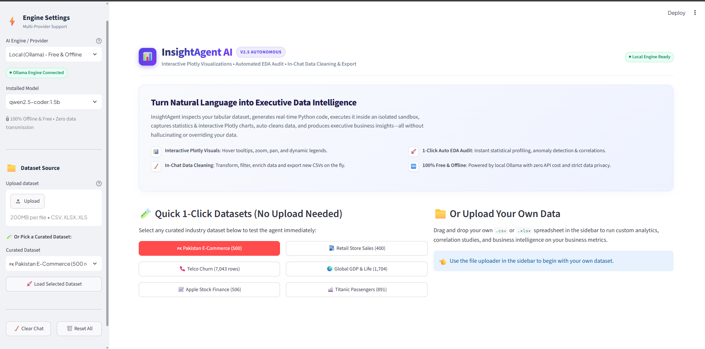
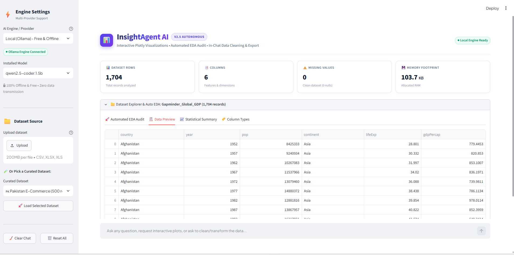
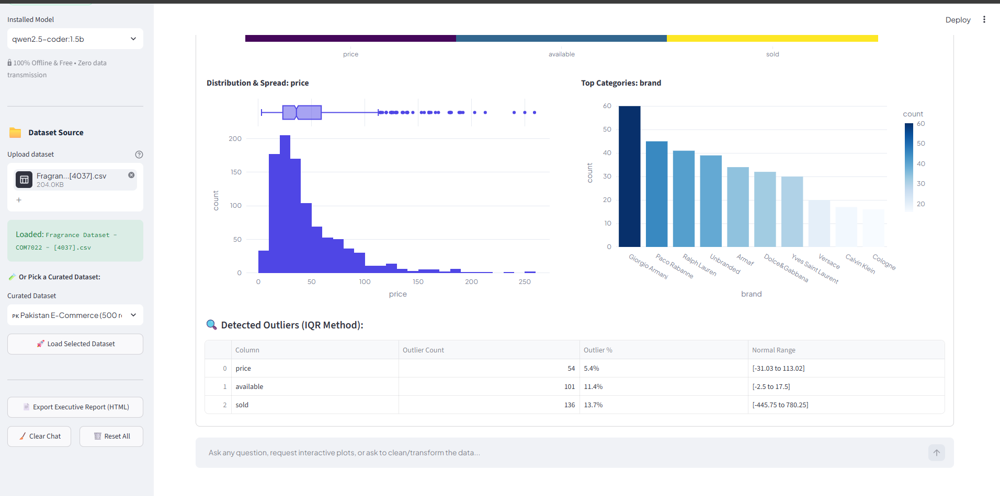
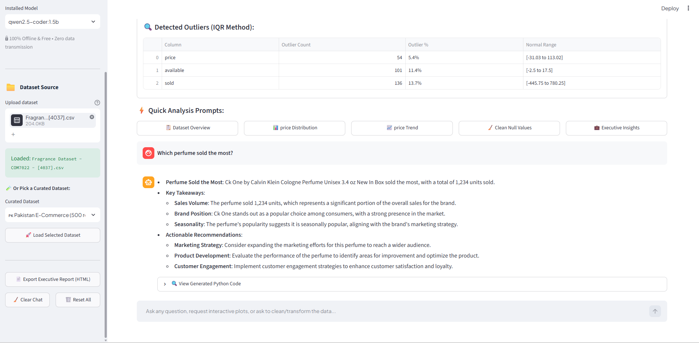
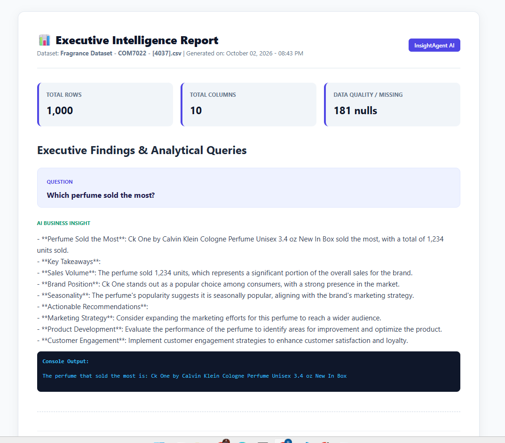
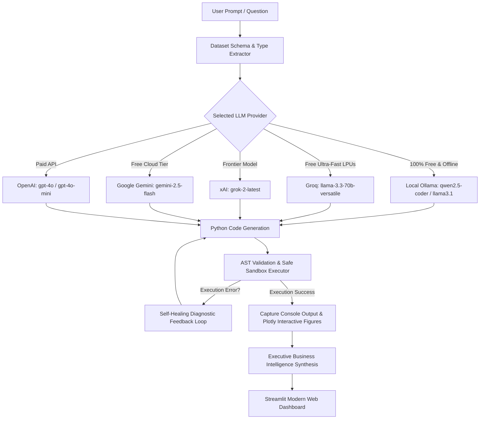

# 📊 InsightAgent AI — Autonomous Data Analysis & Visualization Suite

[](https://insightanalysisagent.streamlit.app/)
[](https://python.org)
[](https://streamlit.io)
[](https://ollama.com)
[](https://groq.com)
[](https://x.ai)
[](https://opensource.org/licenses/MIT)

> 🌐 **Try the Live Application Online**: **[https://insightanalysisagent.streamlit.app/](https://insightanalysisagent.streamlit.app/)**

**InsightAgent AI** is a production-grade, autonomous **Data Science & Visualization Web Application**. It functions as an autonomous **Python Code-Interpreter**: upload any CSV or Excel spreadsheet, prompt it in plain English, and the agent inspects the schema, generates executable Python code, runs it inside an isolated sandbox, captures statistics & interactive Plotly charts, auto-heals execution errors in real time, and synthesizes executive business insights.

Supports **100% Free & Offline Local Ollama** (no API keys, zero cost, total data privacy) alongside **Groq Cloud (Free LPU), xAI Grok, Google Gemini, and OpenAI**.

---

## 📸 Application Preview



---

## 📑 Table of Contents
- [🌐 Live Web Demo](#-live-web-demo)
- [✨ Key Features & Screenshots](#-key-features--screenshots)
- [🏗️ Architecture](#️-architecture)
- [🚀 Quick Start (Local)](#-quick-start-local)
- [🆓 100% Free Offline with Local Ollama](#-100-free-offline-with-local-ollama)
- [💡 Supported Models & Providers](#-supported-models--providers)
- [📁 Project Structure](#-project-structure)
- [🛡️ Privacy & Security](#️-privacy--security)
- [📜 License](#-license)

---

## 🌐 Live Web Demo

Experience the full application live in your browser (no local setup required):

👉 **[https://insightanalysisagent.streamlit.app/](https://insightanalysisagent.streamlit.app/)**

*Tip: For ultra-fast, free cloud analysis on the live demo, select **Groq Cloud** in the sidebar with a free key from [console.groq.com/keys](https://console.groq.com/keys).*

---

## ✨ Key Features & Screenshots

### 1. 🌐 Modern SaaS Interface & 1-Click Curated Datasets
- Drag-and-drop file ingestion (**CSV**, **Excel** `.xlsx`, `.xls`).
- **6 Curated 1-Click Datasets**: Pakistani E-Commerce, Telco Customer Churn, Apple (AAPL) Stock, Gapminder Global GDP, Carseats Retail, and Titanic.
- Live KPI summary cards: dataset dimensions, null counts, and allocated RAM memory footprint.



---

### 2. ⚡ Dynamic Dataset-Aware Quick Prompts
- The agent automatically inspects active columns, types, and categories to generate **5 guaranteed-to-match questions** and interactive Plotly chart suggestions.
- Eliminates guesswork by tailoring prompts specifically to whichever file is loaded.

---

### 3. 🚀 1-Click Automated EDA Executive Audit & Profiling
- Instant automated statistical audit of any uploaded dataset:
  - Missingness percentage alerts & row duplication verification.
  - Statistical outlier isolation using the **Interquartile Range (IQR)** method.
  - Interactive feature correlation heatmaps.



---

### 4. 🧠 Autonomous Python Code Execution & Self-Healing Loop
- **Code Transparency**: Inspect the exact Python code generated and executed for every answer.
- **AST Pre-Validation**: Validates brackets and syntax before running code inside the sandbox.
- **Self-Healing Feedback Loop**: If an error occurs, the agent diagnoses the issue and auto-corrects the code in real time.
- **Zero Raw Tracebacks**: If an analysis is impossible on a dataset, the agent synthesizes a polite, non-technical advisory.



---

### 5. 📄 Standalone Executive Intelligence Reports
- One-click export of the entire session (KPIs, questions, AI takeaways, and console metrics) as a print-ready executive brief.



---

## 🏗️ Architecture



---

## 🚀 Quick Start (Local)

### 1. Clone the Repository
```bash
git clone https://github.com/arslanahmedbhutto/analysis_agent.git
cd analysis_agent
```

### 2. Install Dependencies
```bash
pip install -r requirements.txt
```

### 3. Launch the Application

**Windows 1-Click Launcher**:
Simply double-click:
```bat
run_app.bat
```

**Or from any terminal**:
```bash
streamlit run app.py --server.port 8502
```
Open **`http://localhost:8502`** in your browser.

---

## 🆓 100% Free Offline with Local Ollama

To run completely free on your laptop without any API keys or internet connection:

1. **Install Ollama**: Download from [ollama.com](https://ollama.com).
2. **Pull the lightweight coding model**:
   ```bash
   ollama pull qwen2.5-coder:1.5b
   ```
   *(Or for 16GB+ RAM: `ollama pull llama3.1`)*
3. Start the Ollama background daemon:
   ```bash
   ollama serve
   ```
4. In the Web App sidebar, select **`Local (Ollama) - Free & Offline`**.
5. The app automatically discovers installed models. Zero configuration needed!

---

## 💡 Supported Models & Providers

| Provider | Model | Tier / Cost | Best For |
| :--- | :--- | :--- | :--- |
| **Local (Ollama)** | `qwen2.5-coder:1.5b` | **100% Free & Offline** | Total privacy, local CPU execution, no internet needed |
| **Local (Ollama)** | `llama3.1:8b` | **100% Free & Offline** | Deep reasoning on 16GB+ RAM systems |
| **Groq Cloud** | `llama-3.3-70b-versatile` | **Free Cloud Tier** | ~1.5s responses, 300+ tokens/sec, complex plotting |
| **Groq Cloud** | `llama-3.1-8b-instant` | **Free Cloud Tier** | < 1s latency, ultra-fast queries |
| **xAI Grok** | `grok-2-latest` | API Credits | Frontier intelligence, advanced reasoning & plotting |
| **Google Gemini** | `gemini-2.5-flash` | **Free Cloud Tier** | Large context windows & multimodal insights |
| **OpenAI** | `gpt-4o` / `gpt-4o-mini` | Paid API | Industry-standard coding accuracy |

---

## 📁 Project Structure

```text
analysis_agent/
│
├── app.py                     # Streamlit SaaS Web Application & interactive UI
├── agent.py                   # Multi-provider coding agent with self-healing loop
├── executor.py                # Isolated Python execution sandbox (AST validator, Plotly & stdout)
├── eda.py                     # 1-Click Automated Exploratory Data Analysis & dynamic prompts
├── report_generator.py        # Executive HTML printable brief generator
├── sample_data.py             # 6 industry benchmark datasets & generator
├── run_app.bat                # 1-click Windows desktop launcher
├── requirements.txt           # Python package requirements
│
├── output/                    # UI screenshots & preview assets
│   ├── mainscreen.png
│   ├── output1.png
│   ├── output2.png
│   ├── output5.png
│   └── report_generate.png
│
├── sample_datasets/           # Curated CSV datasets for instant testing
│   ├── Pakistani_ECommerce_Orders.csv
│   ├── Telco_Customer_Churn.csv
│   ├── AAPL_Apple_Stock_History.csv
│   ├── Gapminder_Global_Development.csv
│   ├── Carseats_Retail_Sales.csv
│   └── Titanic_Passenger_Survival.csv
│
├── LangChain Data Agent.ipynb               # Clean, repaired Jupyter Notebook
└── LangChain Data Agent (alt version).ipynb # Colab reference notebook
```

---

## 🛡️ Privacy & Security

- **Local Ollama Mode**: Uploaded data and prompts remain strictly on your local device. No telemetry or API requests are sent externally.
- **Isolated Execution**: Executed Python scripts run in an isolated execution sandbox with protective DataFrame copies.
- **Credential Safety**: API keys are kept in memory/session state or Streamlit Secrets and are strictly excluded from git tracking via `.gitignore`.

---

## 📜 License

Distributed under the **MIT License**. See `LICENSE` for more information.

---

### 👨‍💻 Author
Built with ❤️ by [Arslan Ahmed Bhutto](https://github.com/arslanahmedbhutto)  
🔗 **Live App**: [https://insightanalysisagent.streamlit.app/](https://insightanalysisagent.streamlit.app/)
