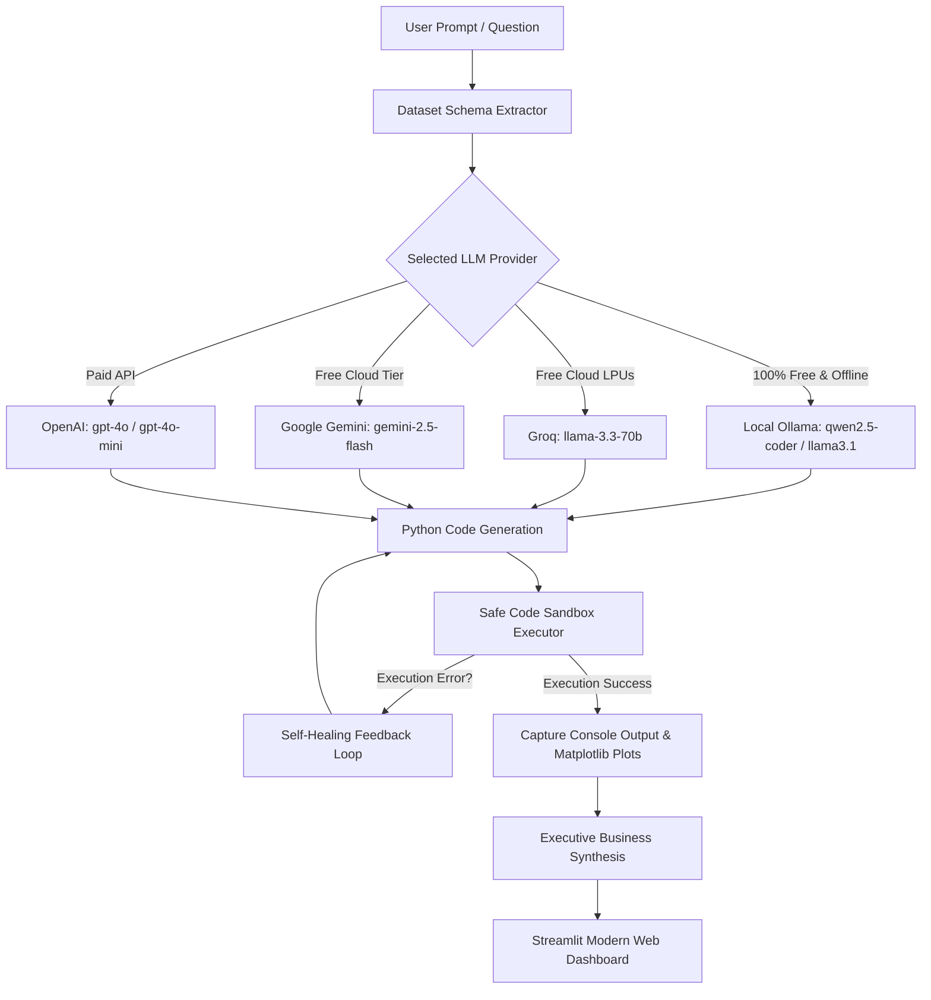

# 📊 InsightAgent AI — Autonomous Data Analysis & Visualization Suite

[](https://python.org)
[](https://streamlit.io)
[](https://ollama.com)
[](https://groq.com)
[](https://opensource.org/licenses/MIT)

**InsightAgent AI** is a local, full-stack, autonomous **Data Science & Visualization Web Application**. It functions as an autonomous **Python Code-Interpreter**: upload any CSV or Excel dataset, prompt it in plain English, and the agent inspects the schema, generates executable Python code, runs it inside an isolated sandbox, captures statistics & charts, auto-fixes execution errors in real time, and synthesizes executive business insights.

Supports **100% Free & Offline Local Ollama** (no API key, zero cost, total data privacy) alongside **Groq, Google Gemini, and OpenAI**.

---

## 📑 Table of Contents
- [✨ Key Features](#-key-features)
- [🏗️ Architecture](#️-architecture)
- [🚀 Quick Start (Local)](#-quick-start-local)
- [🆓 100% Free Offline with Local Ollama](#-100-free-offline-with-local-ollama)
- [☁️ Free Cloud Deployment (Streamlit Community Cloud)](#️-free-cloud-deployment-streamlit-community-cloud)
- [💡 Supported Models & Providers](#-supported-models--providers)
- [📁 Project Structure](#-project-structure)
- [🛡️ Privacy & Security](#️-privacy--security)
- [📜 License](#-license)

---

## ✨ Key Features

- **🌐 Modern SaaS Web Interface**:
  - Drag-and-drop file ingestion (**CSV**, **Excel** `.xlsx`, `.xls`).
  - **1-Click Pakistani E-Commerce Demo**: 500-order retail dataset across Karachi, Lahore, Islamabad, Sukkur, Multan.
  - Interactive dataset explorer, missing value detector, memory footprint, and descriptive statistics.
- **🚀 1-Click Automated EDA Executive Audit**:
  - Instant automated profiling of any uploaded dataset: health check, missingness rate, outlier detection (IQR), and correlation analysis with zero prompting.
- **📊 Interactive Plotly Visualizations**:
  - Generates rich interactive charts (hover tooltips, zoom, pan, category toggles) using **Plotly Express**, with fallback to Matplotlib/Seaborn.
- **🧹 In-Chat Data Cleaning & Modified CSV Export**:
  - Instruct the agent to clean or enrich data (*"remove outliers"*, *"fill missing values"*, *"add column profit = revenue * 0.2"*).
  - Automatically updates the active dataset and generates an instant **Download Transformed CSV** button.
- **📄 Executive HTML Brief Export**:
  - One-click export of the entire session (KPIs, queries, AI business insights, and tables) as a print-ready executive HTML report.
- **🆓 100% Free Local Execution**:
  - Run completely offline with **Local Ollama** (e.g. `qwen2.5-coder:1.5b`, `llama3.1`).
  - No credit card, no API keys, and zero token charges. Data never leaves your machine.
- **🛡️ Custom Autonomous Code-Interpreter**:
  - **Eliminates Data Overwrite Bugs**: Unlike legacy LangChain DataFrame agents that mistakenly overwrite datasets with sample rows, our agent guarantees strict DataFrame preservation.
  - **Self-Healing Error Correction**: If generated Python code throws a syntax or pandas exception, the agent inspects the traceback and auto-repairs the code up to 2 times before responding.
  - **Complete Code Transparency**: Inspect the exact Python code generated and executed for every answer.
- **⚡ Executive Business Synthesis**:
  - Translates console outputs into actionable business takeaways, percentage metrics, and executive summaries.

---

## 🏗️ Architecture



---

## 🚀 Quick Start (Local)

### 1. Clone the Repository
```bash
git clone https://github.com/arslanahmedbhutto/analysis_agent.git
cd analysis_agent
```

### 2. Install Dependencies
```bash
pip install -r requirements.txt
```

### 3. Launch the Application

**Windows 1-Click Launcher**:
Simply double-click:
```bat
run_app.bat
```

**Or from any terminal**:
```bash
streamlit run app.py
```
Open **`http://localhost:8501`** in your browser.

---

## 🆓 100% Free Offline with Local Ollama

To run completely free without any API keys:

1. **Install Ollama**: Download from [ollama.com](https://ollama.com).
2. **Pull the lightweight coding model**:
   ```bash
   ollama pull qwen2.5-coder:1.5b
   ```
   *(Or for 8GB+ RAM: `ollama pull llama3.1`)*
3. In the Web App sidebar, select **`Local (Ollama)`**.
4. The app automatically discovers installed models. No API key needed!

---

## ☁️ Free Cloud Deployment (Streamlit Community Cloud)

You can host this application online for free forever on [Streamlit Community Cloud](https://share.streamlit.io):

1. Fork or push this repository to your GitHub account.
2. Go to **[share.streamlit.io](https://share.streamlit.io)** and log in with GitHub.
3. Click **"New app"** and select:
   - **Repository**: `your-username/analysis_agent`
   - **Branch**: `main`
   - **Main file path**: `app.py`
4. *(Optional for Cloud)* Click **Advanced Settings** > **Secrets** to provide cloud keys:
   ```toml
   GROQ_API_KEY = "gsk_..."
   GEMINI_API_KEY = "AIzaSy..."
   ```
5. Click **Deploy!** Your app is live with a public URL in 60 seconds!

---

## 💡 Supported Models & Providers

| Provider | Model | Tier / Cost | Best For |
| :--- | :--- | :--- | :--- |
| **Local (Ollama)** | `qwen2.5-coder:1.5b` | **100% Free & Offline** | Total privacy, local CPU execution, no internet needed |
| **Local (Ollama)** | `llama3.1:8b` | **100% Free & Offline** | Deep reasoning on 16GB+ RAM systems |
| **Groq** | `llama-3.3-70b-versatile` | **Free Cloud Tier** | 300+ tokens/sec, complex reasoning & plotting |
| **Groq** | `llama-3.1-8b-instant` | **Free Cloud Tier** | Ultra-low latency queries |
| **Google Gemini** | `gemini-2.5-flash` | **Free Cloud Tier** | Large context windows & multimodal |
| **OpenAI** | `gpt-4o` / `gpt-4o-mini` | Paid API | Industry standard coding accuracy |

---

## 📁 Project Structure

```text
analysis_agent/
│
├── app.py                     # Streamlit modern Web Application & UI
├── agent.py                   # Multi-provider coding agent with self-healing loop
├── executor.py                # Isolated Python execution sandbox (captures stdout, Plotly & figures)
├── eda.py                     # 1-Click Automated Exploratory Data Analysis & profiling engine
├── report_generator.py        # Executive HTML/PDF-ready session report generator
├── sample_data.py             # 500-order Pakistani e-commerce dataset generator
├── run_app.bat                # 1-click Windows launcher
├── requirements.txt           # Python package requirements
├── .env.example               # Environment variables template
├── .gitignore                 # Excludes caches, secrets, and environments
│
├── LangChain Data Agent.ipynb               # Clean, repaired Jupyter Notebook with prompt fix
└── LangChain Data Agent (alt version).ipynb # Colab reference notebook with saved outputs
```

---

## 🛡️ Privacy & Security

- **Local Ollama Mode**: Uploaded data and prompts remain strictly on your local device. No telemetry or API requests are sent externally.
- **Isolated Execution**: Executed Python scripts are isolated in a restricted execution context with protective DataFrame copies.
- **Credential Safety**: API keys are kept in session state or `.env` and are strictly excluded from git tracking via `.gitignore`.

---

## 📜 License

Distributed under the **MIT License**. See `LICENSE` for more information.

---

### 👨‍💻 Author
Built with ❤️ by [Arslan Ahmed Bhutto](https://github.com/arslanahmedbhutto)
